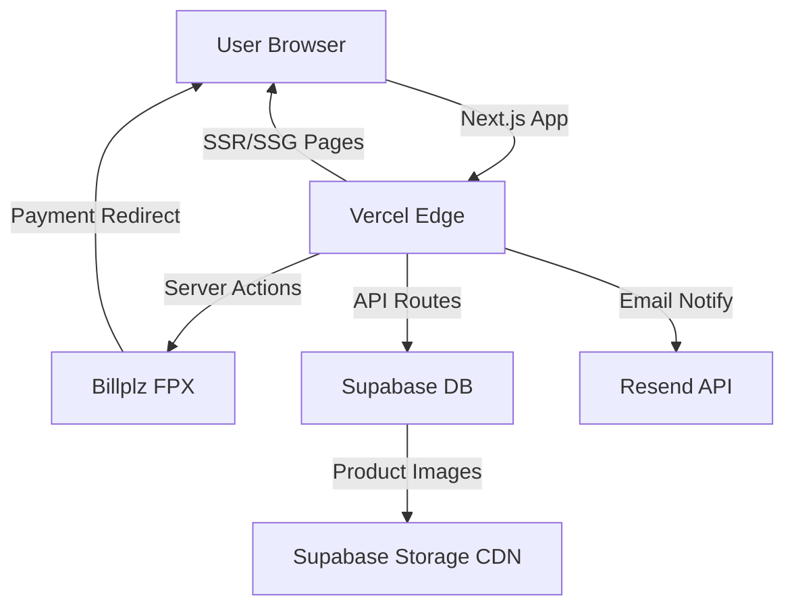

# 🚀 MegaHelper — Pre-Handover Audit & Production Guide

## 1. Build Health Check

| Check | Status | Details |
|-------|--------|---------|
| **Production Build** | ✅ Pass | `next build` compiled with zero errors |
| **TypeScript** | ✅ Pass | No type errors detected |
| **Static Pages** | ✅ 17/17 generated | All routes render correctly |
| **API Routes** | ✅ 2 routes | `/api/admin/update-order-status`, `/api/notify` |
| **Dynamic Routes** | ✅ 2 routes | `/product/[id]`, `/admin/edit/[id]` |

---

## 2. Security Audit

### ✅ What's Good
- **Admin API route** (`/api/admin/update-order-status`) validates JWT tokens and checks admin email before allowing any writes
- **Admin layout** gate-checks user email before rendering admin pages
- **Service role key** is only used server-side (in `checkout.ts`, API routes) — never exposed to the browser
- **`.env.local`** is in `.gitignore` — secrets are not committed to git
- **Input validation** exists on the notify API (email format, amount, file type)

### ⚠️ Items To Address Before Go-Live

> [!CAUTION]
> ### 1. Billplz is on SANDBOX mode
> Your `.env.local` currently points to `billplz-sandbox.com`. Real payments will NOT process.
> 
> **Action:** Uncomment the production Billplz keys (lines 6-8) and comment out the sandbox keys (lines 11-13):
> ```diff
> ## Billplz
> -# BILLPLZ_API_KEY=3024ec08-da0d-48f1-acf1-6faa632b6bdd
> -# BILLPLZ_COLLECTION_ID=etw0imar
> -# BILLPLZ_ENDPOINT=https://www.billplz.com/api/v3/bills
> +BILLPLZ_API_KEY=3024ec08-da0d-48f1-acf1-6faa632b6bdd
> +BILLPLZ_COLLECTION_ID=etw0imar
> +BILLPLZ_ENDPOINT=https://www.billplz.com/api/v3/bills
> 
> ## Billplz Sandbox
> -BILLPLZ_API_KEY=faa1e81b-a931-4f5d-b96b-ec47774c6fb0
> -BILLPLZ_COLLECTION_ID=80mq21ke
> -BILLPLZ_ENDPOINT=https://www.billplz-sandbox.com/api/v3/bills
> +# BILLPLZ_API_KEY=faa1e81b-a931-4f5d-b96b-ec47774c6fb0
> +# BILLPLZ_COLLECTION_ID=80mq21ke
> +# BILLPLZ_ENDPOINT=https://www.billplz-sandbox.com/api/v3/bills
> ```

> [!CAUTION]
> ### 2. `NEXT_PUBLIC_BASE_URL` is `localhost`
> The checkout redirect URL (`callback_url`, `redirect_url`) currently points to `http://localhost:3000`. After deploying, this **must** be your production domain.
> 
> ```diff
> -NEXT_PUBLIC_BASE_URL=http://localhost:3000
> +NEXT_PUBLIC_BASE_URL=https://your-domain.vercel.app
> ```

> [!WARNING]
> ### 3. Image hostname wildcard
> `next.config.ts` allows images from **any** hostname (`hostname: '**'`). This is fine for development but consider restricting to just the Supabase storage hostname for production:
> ```ts
> hostname: 'rfbtayenewtezdqgikvx.supabase.co',
> ```

> [!WARNING]
> ### 4. Admin email list is hardcoded in 3 places
> The `ALLOWED_ADMIN_EMAILS` list is duplicated in:
> - [Navbar.tsx](file:///c:/Users/Oswin/Documents/03-vibe-coding/01-active/student-hub/components/Navbar.tsx#L20) (controls shield icon visibility)
> - [admin/layout.tsx](file:///c:/Users/Oswin/Documents/03-vibe-coding/01-active/student-hub/app/admin/layout.tsx#L14) (controls page access)
> - [api/admin/update-order-status/route.ts](file:///c:/Users/Oswin/Documents/03-vibe-coding/01-active/student-hub/app/api/admin/update-order-status/route.ts#L4) (controls API access)
> 
> If the customer ever needs to change admin emails, they must update **all three files**. Consider moving this to a single shared config file or environment variable in the future.

> [!NOTE]
> ### 5. Resend "from" address
> The notify API sends emails from `onboarding@resend.dev` (Resend's sandbox sender). For production, the customer should verify their own domain in Resend and update [line 95 of notify/route.ts](file:///c:/Users/Oswin/Documents/03-vibe-coding/01-active/student-hub/app/api/notify/route.ts#L95).

---

## 3. Deployment to Vercel (Recommended)

### Step-by-Step

1. **Push to GitHub** (if not already)
   ```bash
   git add -A
   git commit -m "production ready"
   git push origin main
   ```

2. **Go to [vercel.com](https://vercel.com)** → Import the GitHub repo

3. **Set Environment Variables** in Vercel Dashboard → Settings → Environment Variables:
   | Variable | Value |
   |----------|-------|
   | `NEXT_PUBLIC_SUPABASE_URL` | `https://rfbtayenewtezdqgikvx.supabase.co` |
   | `NEXT_PUBLIC_SUPABASE_ANON_KEY` | *(copy from .env.local)* |
   | `SUPABASE_SERVICE_ROLE_KEY` | *(copy from .env.local)* |
   | `BILLPLZ_API_KEY` | **Production key** (not sandbox!) |
   | `BILLPLZ_COLLECTION_ID` | **Production ID** (`etw0imar`) |
   | `BILLPLZ_ENDPOINT` | `https://www.billplz.com/api/v3/bills` |
   | `NEXT_PUBLIC_BASE_URL` | `https://your-app.vercel.app` ← **Update after first deploy** |
   | `RESEND_API_KEY` | *(copy from .env.local)* |
   | `ADMIN_EMAIL` | `oswin0829@gmail.com` |

4. **Deploy** → Vercel builds automatically

5. **After deploy**, go back and update `NEXT_PUBLIC_BASE_URL` to the actual Vercel URL, then **redeploy**.

6. **Custom Domain** (optional): Add your domain in Vercel → Settings → Domains

---

## 4. Post-Deployment Checklist

- [ ] Visit the live site and verify the homepage loads
- [ ] Test the full checkout flow with a small real payment
- [ ] Verify admin login + shield icon appears for admin email
- [ ] Test order status update (pending → fulfilled) 
- [ ] Check email notification arrives when an order is placed
- [ ] Test on mobile (responsive layout)
- [ ] Verify all footer links (Privacy, Terms, Refund) work
- [ ] Verify social media bubbles link to correct accounts

---

## 5. Keeping the Website Alive — Best Practices

### 🟢 Uptime & Monitoring

| Practice | Tool | Cost |
|----------|------|------|
| **Uptime monitoring** | [UptimeRobot](https://uptimerobot.com) | Free (50 monitors) |
| **Error tracking** | [Sentry](https://sentry.io) for Next.js | Free tier available |
| **Analytics** | [Vercel Analytics](https://vercel.com/analytics) or Google Analytics | Free |

### 🔐 Security Maintenance
- **Rotate API keys** every 3-6 months (Billplz, Resend, Supabase)
- **Never share** the `SUPABASE_SERVICE_ROLE_KEY` — it bypasses all Row Level Security
- **Enable Supabase RLS** on the `orders` and `products` tables if not already
- **Keep dependencies updated** — run `npm audit` monthly and `npm update` quarterly

### 💾 Database (Supabase)
- Supabase free tier includes 500MB database + 1GB storage
- **Enable daily backups** in Supabase Dashboard → Settings → Database → Backups (available on Pro plan)
- Monitor storage usage for product images and receipts
- Consider archiving old orders after 12 months

### 🚀 Performance
- Vercel's Edge Network handles CDN caching automatically
- Product images are served via Supabase Storage CDN
- Static pages (home, terms, privacy, refund) are pre-rendered at build time for instant loads

### 📦 Dependency Health
Run these periodically:
```bash
# Check for security vulnerabilities
npm audit

# Update minor/patch versions safely
npm update

# Check for major version updates (review changelog before updating)
npx npm-check-updates
```

### 🔄 Deployment Workflow
- Any push to `main` on GitHub triggers automatic redeployment on Vercel
- Use **Preview Deployments** (Vercel auto-creates these on PRs) to test changes before merging
- Roll back instantly via Vercel Dashboard if a deployment breaks something

---

## 6. Architecture Summary



### File Structure Quick Reference
| Path | Purpose |
|------|---------|
| `app/page.tsx` | Homepage + hero section |
| `app/admin/` | Admin dashboard, orders, product CRUD |
| `app/api/` | Server-side API routes (order updates, email) |
| `app/actions/checkout.ts` | Server action for Billplz payment flow |
| `components/Navbar.tsx` | Global navigation with admin shield |
| `components/Storefront.tsx` | Product grid with search/filter |
| `components/SocialBubbles.tsx` | Floating social media buttons |
| `utils/supabase.ts` | Client-side Supabase instance |
| `store/cartStore.ts` | Zustand cart state management |
| `middleware.ts` | Auth session refresh |
